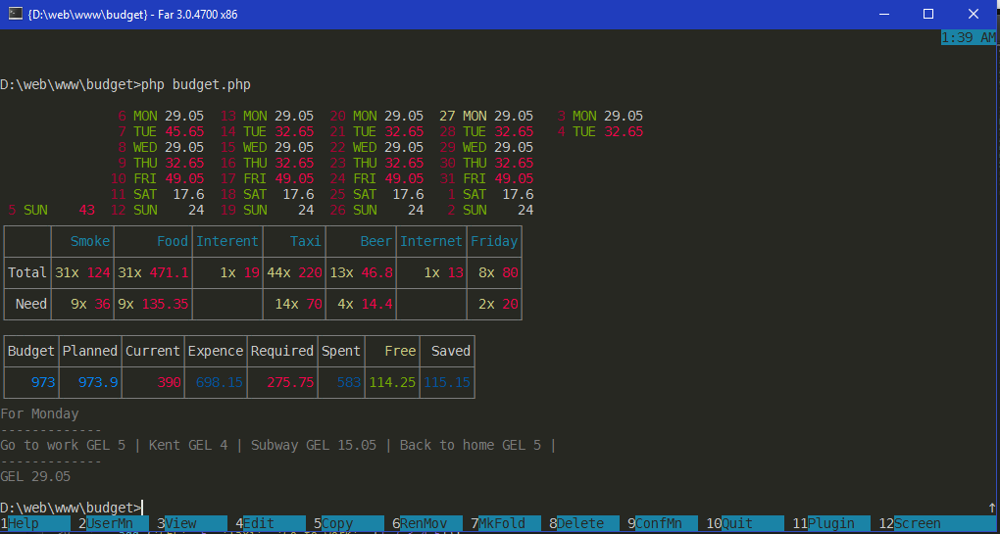
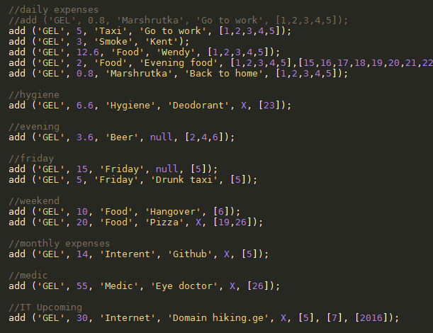

Expense Planner
================

Usage

```
php budget.php [+/-][d]
```

Budget for current day
```
php budget.php
```

Budget for next day
```
php budget.php +
```

Budget for previous day
```
php budget.php -
```

Budget for day after tommorow
```
php budget.php +2
```

Budget for 30 of current month
```
php budget.php 30
```

Fill user.php with your budget plan. After end of current day modify
```
balance ([YOUR_CURRENT_BALANCE]);
```

And you will get how much you have ecnomied.

Result



Setup

